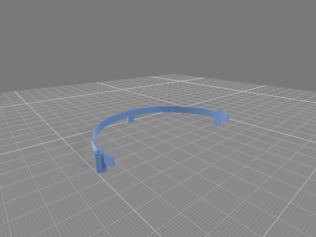

# **Perpetual Steel Ball Track**

### As perpetual as the laws of physics of this universe allow
 

 

YouTube Video  
https://www.youtube.com/watch?v=C1I4kvoMqeI

[**-> views**](#views)  
[**-> source**](source)  
 

## Background
The idea for building this device came to me while looking at a commercially available version. It was a long journey with much trial and error before the replica finally worked. The track had to be bent from steel wire, parts for the frame, collecting bowl, and supports had to be made with the 3D printer, the electromagnet had to be wound, and the electronics and software had to be developed
 

## Build
The building instructions for this project are not complete, they are only intended as an aid for a replica  
[**-> 3D-Printed Parts**](stl)

**Inner and Outer Track Template**  

  
The track was bent from 1.5 mm galvanized iron wire, as this is easy to work with and solder,  
the templates are meant to make bending easier  
 

**Cup and Cup Guide**  

  
To prevent the steel ball from derailing a guide is glued to the outlet of the cup hole  
 

**Rail Type 1 and 2**  

  
Type 1 is fixed to the rim of the cup, two pieces of type 2 are mounted above,  
to connect cup and rails sticks of steel wire are put in the provided holes  
 

**Electro Magnet Bobbin and Magnetic Field Guide Template**  

  
The bobbin is completely wound with 0.8 mm enameled copper wire,  
the soft iron core has a diameter of 20 mm and is 16 mm long,  
the magnetic field guide is intended to center the steel ball in front of the magnet,  
it is made from 3 mm thick sheet iron, only the outlines of the template are relevant,  
so the hole in the template is not transferred to the sheet  
(the field guide can possibly be omitted)  
 

**Inductive Proximity Sensor and Arduino**  

  
This kind of sensor is normally used in 3D-Printers, see the schematic for more details,  
an Arduino Mega 2560 handles timing and delays for sensor and magnet,  
the LCD shows current settings, the keys allow timing changes  
 

## Schematic

 

## Operation
**Right Key**  
press about 1.5 s to enter or exit time and delay settings

**Select Key**  
change values in 100 / 500 / 1000 ms steps

**Left Key - / Right Key +**  
sensor OFF -> magnet ON delay

**Down Key - / Up Key +**  
magnet ON time  

(timing is saved to EEPROM after changes)

**Display**  
*Line 1*  
status or averaged sensor ON to OFF time in us

*Line 2*  
sensor OFF -> magnet ON delay in ms  
magnet ON time in ms  
change value in ms

**Calculation**  
sensor ON to OFF time is measured in TIMER4_CAPT and used as reciprocal relative speed (Vr)  
Vr is averaged and weighted, it influences the sensor OFF -> magnet ON delay
 

 
 

**Inspired by**  
https://www.youtube.com/watch?v=r_LG8FDt51U&t

**How to make a Steel Marble Track**  
https://www.youtube.com/watch?v=kPguktA674w

**Code Edited and Developed with**  
https://code.visualstudio.com/  
https://platformio.org/

 

---

 

## Views

 
 

Stepup Electronic and Capacitor Charge Resistors  

 
 

Low ESR Capacitors 4 x 3300uF 35V  

 
 

Inductive Proximity Sensor and Electro Magnet on Top of Magnetic Field Guide  

 
 

Arduino Mega 2560 with LCD and Key Shield  

 
 

 
 

---

[qrt@qland.de](mailto:qrt@qland.de) 240731
